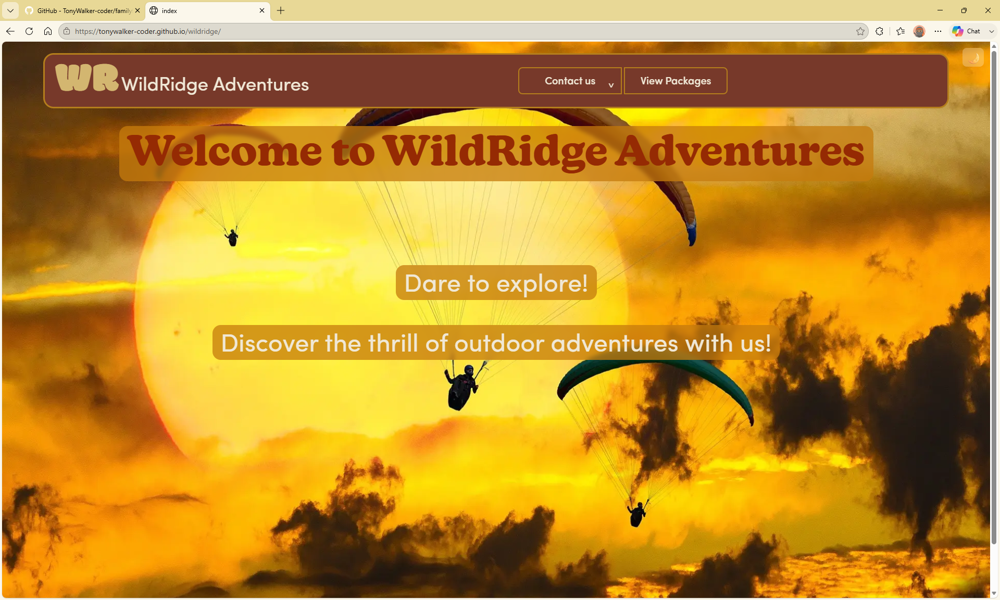
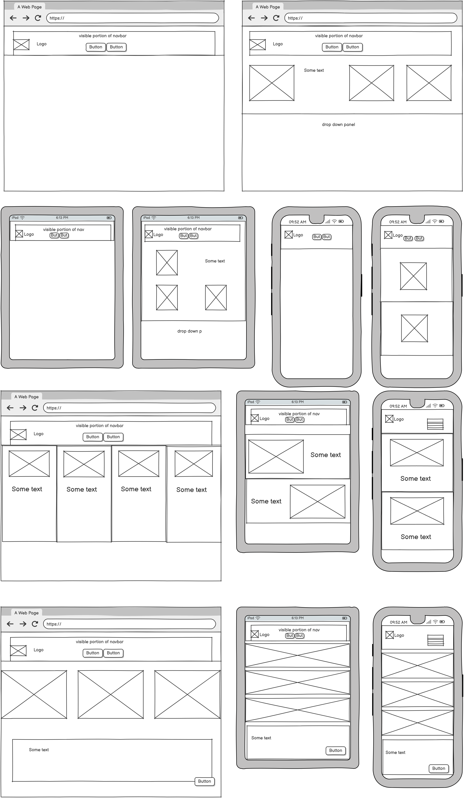

  <link rel="preconnect" href="https://fonts.googleapis.com">
  <link rel="preconnect" href="https://fonts.gstatic.com" crossorigin>
  <link href="https://fonts.googleapis.com/css2?family=Antic+Didone&family=Modak&family=Roboto:ital,wght@0,100..900;1,100..900&display=swap" rel="stylesheet">


[Deployed Website](https://tonywalker-coder.github.io/wildridge/)

## License

This project is licensed under the MIT License.
You are free to use, modify, distribute, and build upon this project for personal or commercial purposes.
See the full license in the [**LICENSE**](LICENSE) file for complete details

## Table of Contents

- [Project Rationale](#projectrationale)
- [Target Audience](#targetaudience)
- [User Stories](#user-stories)
- [Navbar link to Home Page](#navbar-link-to-home-page)
- [GitHub Projects](#github-projects)
- [Supporting Documentation](#supporting-documentation)
- [Tech Stack](#tech-stack)
- [Folder Structure](#folder-structure)
- [Colour Palette](#color-palette)
- [Typography](#typography)
- [Design Tokens and System Consistency](#tokens)
- [Acknowledgments](#acknowledgments)
- [Local Deployment](#local-deployment)
- [Social Media](#social-media)
- [Testing Documentation](#testing-documentation)

## Project Rationale

Wildridge Adventures was created to provide visitors with a simple and engaging way to explore outdoor adventure activities, view weather information, and submit booking enquiries.

## Target Audience

The target audience is adults and families interested in outdoor activities such as hiking, climbing, skiing, and off-road driving who wish to obtain information and make booking enquiries online.

## user stories

## As the site owner  _(must have)_
I want the site to feel exciting, dynamic, and visually striking,
so that users immediately sense the adventurous nature of the extreme hiking and camping tours on offer.

## Description
The site should present high‑quality images and clear descriptions of each tour. The design must be clean, crisp, and uncluttered, with a consistent theme across all pages. It must work seamlessly on both mobile and desktop devices. Contact details should be easy to find and accessible from any page.

## Acceptance Criteria
* 	The homepage establishes the overall theme and visual identity of the site.
* 	A fixed navbar provides consistent navigation across all pages.
* 	The layout is fully responsive across a range of breakpoints (mobile, tablet, desktop, large desktop).
* 	The homepage links to the product page.
* 	A hero image or gallery
* 	A short, engaging description
* 	Clear calls to action
* 	Contact details are visible or easily accessible from the navbar/footer

## As the owner _(must have)_
I want the site to comply with recognised accessibility standards
so that all users, regardless of ability or device, can access and use the site effectively.

## Description
The site should meet the requirements of WCAG 2.1 Level AA, ensuring that content is perceivable, operable, understandable, and robust. This includes providing sufficient colour contrast, supporting keyboard-only navigation, ensuring compatibility with screen readers, and maintaining a consistent, predictable design across all pages. Accessibility must be considered from the start of development, not retrofitted later.

## Acceptance Criteria
* 	The site must use a consistent colour theme across all pages.
* 	The site must offer both light and dark themes.
* 	The colour palette must meet WCAG 2.1 AA contrast ratios:
* 	Minimum 4.5:1 for normal text
* 	Minimum 3:1 for large text
* 	All interactive elements (links, buttons, menus, cards) must be fully operable using keyboard input alone.
* 	Screen reader support must be ensured through:
* 	Semantic HTML structure
* 	Meaningful alt text for images
* 	ARIA labels where appropriate
* 	Focus states must be visible, clear, and consistent.
* 	Navigation must be predictable and consistent across the site.
* 	No content should flash more than three times per second (to avoid seizure risk)

## As a first‑time visitor _(must have)_
I want a website that is simple to navigate with clearly visible links
so that I can quickly understand where to go and how to find key information.

## Description
The site must provide intuitive navigation for new users. A well‑positioned, consistent navbar should guide visitors through the main sections of the site, and contact information must be easy to locate without searching or guessing.

## Acceptance Criteria
* 	A consistent navbar appears on all pages.
* 	The navbar contains clear, descriptive labels for each major section.
* 	Contact details are accessible via the navigation bar.
* 	Navigation items remain visible and usable across all screen sizes.
* 	The homepage provides clear signposts to the main areas of the site.

## As a regular user _(must have)_
I want to feel confident recommending the site to others,
and I want the option to sign up for a newsletter
so that I can stay informed about new tours and updates.

## Description
The site should feel well-maintained, trustworthy, and professional. Users must be able to sign up for the company newsletter. A dedicated newsletter sign-up feature should collect user details and provide clear confirmation when the sign-up is successful.

## Acceptance Criteria
* 	A dedicated newsletter sign‑up feature should be available via a button and modal.
* 	The feature should includes fields for at least name and email.
* 	Submitting the data displays a clear success message.
* 	The feature uses validation to prevent incomplete or invalid submissions.

## As a customer _(must have)_
I want to be able to leave feedback
so that I can share my experience and help improve the service.

## Description
The site must include a dedicated feedback option where customers can submit comments, suggestions, or concerns. The feature should be simple, accessible, and provide confirmation once feedback has been submitted.

## Acceptance Criteria
* 	A dedicated feedback function must exists.
* 	Use a dedicated button and modal for this.
* 	The feature will take the form of a modal and includes fields for name, email, and feedback message.
* 	The feature validates required fields before submission.
* 	A clear success message is shown after the data is submitted.

## As an owner _(should have)_
As the site owner, I want the site to display our holidays so that visitors can quickly understand what tours we offer.

## Description
The site should present each holiday/tour using visually engaging cards that highlight key information and encourage users to explore further.

## Acceptance Criteria
* Cards are created to visually represent each tour, including title, image, short description, and key details.
* Cards are responsive and display correctly on mobile, tablet, and desktop.
* Clicking a card takes the user to the full tour details page.

## As a customer _(could have)_
As a customer, I would like extra information about the locations so that I can better understand the environment, risks, and conditions before booking.

## Description
The site can integrate external APIs to provide additional real‑time or contextual information about each destination, such as weather, terrain, safety alerts, or travel logistics.

## Acceptance Criteria
* An API interface is implemented to fetch location‑specific weather information.
* Relevant data is displayed clearly on the tour details page by way of a modal.

## Navbar link to Home Page

The navigation bar is intentionally kept minimal, with the home link integrated into the brand title to preserve valuable horizontal space. This approach keeps the header clean and readable across all screen sizes while still giving users an immediate, intuitive route back to the homepage. Although it departs slightly from conventional UI patterns, it supports the overall design goal of a compact, uncluttered navigation experience.

## GitHub Projects

This project is managed using GitHub Projects to mirror real‑world development practices. Even though I’m working solo, the project board helps me organise tasks, track progress, and maintain a clear development workflow. Using issues, milestones, and a structured board keeps the work transparent and makes the project easier to maintain and extend over time.

[Project workflow][pd]

[pd]:screenshots/projects.png

## Supporting Documentation



[Wire Frames PDF](docs/wireframe.pdf)

## Testing Documentation

[Testing Documentation](docs/testing.md)

## Tech Stack

- HTML5
- CSS3
- JavaScript
- JQuery
- GitHub Pages (deployment)
- GitHub Project (user stories)
- Balsamiq.com (wireframes)
- canva.com (image editing)
- Copilot
- fontawesome
- Open-Meteo weather API
- 7timer.info (weather API)
- adobe.com (colour contrast analyzer)
- google.com (google maps)

## Folder Structure

```text

└── 📁wildridge
    └── 📁assets
        └── 📁css
            ├── tokens.css
            └── style.css
        └── 📁favicon
        └── 📁fonts
        └── 📁images
        └── 📁gallery
        └── 📁js
            └── script.js
    └── 📁docs
        └── testing.md
        └── wireframe.pdf
        └── wireframe.png
    └── 📁screenshots
    └── 📁docs
        └── testing.md
    └── 📁testing
    ├── .gitignore
    ├── index.html
    ├── packages.html
    ├── navbar.html
    ├── driving.html
    ├── climbing.html
    ├── skiing.html
    └── hiking.html
```
<a id="color-palette"></a>
## Colour Palette

The project uses a paired dark an
d light colour system designed to feel warm, earthy, and consistent across the site. The dark theme is built around deep browns and ember‑orange accents, giving it a grounded, rustic tone that fits the overall aesthetic. Soft cream tones and muted variants provide contrast for text, surfaces, and subtle UI elements. The light theme mirrors the same structure but shifts into gentle lilacs and warm browns, keeping the identity intact while offering a brighter, more open feel. Both palettes are structured so backgrounds, surfaces, accents, and muted tones map cleanly between modes, ensuring predictable contrast and a cohesive visual rhythm throughout the interface.

### Dark Theme

<div style="display:flex; gap:10px;">
  <div style="width:60px; height:60px; background:#563127; border-radius:6px;"></div>
  <div style="width:60px; height:60px; background:#602718; border-radius:6px;"></div>
  <div style="width:60px; height:60px; background:#6e3223; border-radius:6px;"></div>
  <div style="width:60px; height:60px; background:#77392a; border-radius:6px;"></div>
  <div style="width:60px; height:60px; background:#7e5044; border-radius:6px;"></div>
  <div style="width:60px; height:60px; background:#f0e8d6; border-radius:6px;"></div>
  <div style="width:60px; height:60px; background:#d3b670; border-radius:6px;"></div>
  <div style="width:60px; height:60px; background:#d6a32b; border-radius:6px;"></div>
  <div style="width:60px; height:60px; background:rgba(255, 249, 235, 0.4); border-radius:6px;"></div>
  <div style="width:60px; height:60px; background:rgb(180, 126, 28); border-radius:6px;"></div>
  <div style="width:60px; height:60px; background:rgb(236, 173, 56); border-radius:6px;"></div>
  <div style="width:60px; height:60px; background:#ac674c; border-radius:6px;"></div>
  <div style="width:60px; height:60px; background:#ba7e66; border-radius:6px;"></div>
  <div style="width:60px; height:60px; background:#c46742; border-radius:6px;"></div>
  <div style="width:60px; height:60px; background:#efdaa8; border-radius:6px;"></div>
</div>

### Light Theme

<div style="display:flex; gap:10px;">
  <div style="width:60px; height:60px; background:#eece78; border-radius:6px;"></div>
  <div style="width:60px; height:60px; background:#bb942a; border-radius:6px;"></div>
  <div style="width:60px; height:60px; background:#eca65b; border-radius:6px;"></div>
  <div style="width:60px; height:60px; background:#ebc45aad; border-radius:6px;"></div>
  <div style="width:60px; height:60px; background:#ad2727; border-radius:6px;"></div>
  <div style="width:60px; height:60px; background:#cb5828; border-radius:6px;"></div>
  <div style="width:60px; height:60px; background:#700000; border-radius:6px;"></div>
  <div style="width:60px; height:60px; background:#9e390e; border-radius:6px;"></div>
  <div style="width:60px; height:60px; background:#ad272793; border-radius:6px;"></div>
  <div style="width:60px; height:60px; background:#5d0b0b; border-radius:6px;"></div>
  <div style="width:60px; height:60px; background:#c25f38; border-radius:6px;"></div>
  <div style="width:60px; height:60px; background:#d1712c; border-radius:6px;"></div>
  <div style="width:60px; height:60px; background:#cc954d; border-radius:6px;"></div>
  <div style="width:60px; height:60px; background:#cc824d; border-radius:6px;"></div>
  <div style="width:60px; height:60px; background:#c93636; border-radius:6px;"></div>
</div>

### Alert colours

- success background
- success text
- warning background
- warning text
- error background
- error text

<div style="display:flex; gap:10px;">
  <div style="width:60px; height:60px; background:#d8f5d2; border-radius:6px;"></div>
  <div style="width:60px; height:60px; background:#245b1f; border-radius:6px;"></div>
  <div style="width:60px; height:60px; background:#fff4d1; border-radius:6px;"></div>
  <div style="width:60px; height:60px; background:#7a5a00; border-radius:6px;"></div>
  <div style="width:60px; height:60px; background:#f8d4d4; border-radius:6px;"></div>
  <div style="width:60px; height:60px; background:#7a1f1f; border-radius:6px;"></div>
</div>


## Typography

The typography system pairs a bold, characterful display face with a clean, modern body font to create a balance between personality and readability. Headings carry the visual identity and set the tone, while body text stays neutral and highly legible, giving the layout a clear hierarchy and a consistent rhythm across the site.

### Headings — Didone

High Fashion and Luxury: Because Didone fonts look elegant, sharp, and refined, they are heavily favored by luxury brands (like Dior and Cartier) and high-fashion magazines like Vogue.

<p style="font-family:'Didone'; font-size:24px;">
The quick brown fox jumps over the lazy dog.
</p>

A clean, versatile sans‑serif chosen for clarity and comfort, ideal for longer passages and general UI text.


### Body Text — Roboto

Dual Nature: Roboto combines a mechanical skeleton and largely geometric forms with friendly, open curves.

<p style="font-family:'Roboto'; font-size:24px;">
  The quick brown fox jumps over the lazy dog.
</p>

<a id="tokens"></a>
## Design Tokens and System Consistency

A token set gives your project a single source of truth for every reusable value, so colours, spacing, typography, and component behaviour all stay consistent no matter where they’re used. Instead of scattering hex codes, font weights, or layout numbers across different files, each value is defined once and referenced everywhere, which makes the system predictable and easy to maintain. When you update a token, the entire interface updates with it, keeping the design coherent as the project grows. Tokens also make dark and light themes straightforward, because each theme simply swaps out its own set of values while the components continue to reference the same names. This approach turns the design into a structured system rather than a collection of ad‑hoc choices, and it ensures that every part of the site speaks the same visual language.

## Acknowledgments

Public‑domain photos play a key role in bringing this project’s spirit to life. Their open availability makes it possible to showcase the drama and intensity of extreme environments, helping to express the sense of challenge, risk, and possibility at the heart of the site’s concept.

This site uses public‑domain imagery from [pixabay][pb].

[pb]: https://pixabay.com/

### Google Maps

This project integrates Google Maps services for location and mapping features.  
Usage complies with the Google Maps Platform Terms of Service.

### Open-Meteo weather API

Due to 7timer.info no longer being available after this project was
handed in this API was rewritten by Microsoft Copilot in the 
interest of getting a speedy solution using the Open-Meteo weather API

### Copilot

I used Microsoft Copilot to help write some of the text for this site.
The goal wasn’t to fill space — it was to make sure the descriptions actually felt relevant to adventure holidays, instead of using generic filler or Lorem Ipsum.
Everything Copilot produced was edited and shaped to fit the tone and design of the project.

Microsoft Copilot was used to assist with the replacement of the original weather API implementation after the previous provider discontinued its free service.

The assistance was used to accelerate the migration to an alternative weather service and to adapt the existing weather functionality to the new API structure.

Microsoft Copilot was used to fix a bug from the original code where a failed API request could leave the application in a perpetual loading state. Error handling was subsequently implemented to ensure that network or service failures are handled gracefully and that appropriate feedback is presented to the user.

### Google Fonts

This project uses fonts supplied by Google Fonts under their respective licences.

## Local Deployment

1. Clone the [repository.](https://github.com/TonyWalker-coder/wildridge)
2. Open project in VS Code.
3. Install/use the Live Server extension.
4. Right-click index.html → Open with Live Server.
5. Browse to the local URL provided by Live Server.

### Social Media

This project represents a fictional business, and therefore no real social‑media accounts exist for it.
The social‑media icons link to the official platform homepages purely to demonstrate the intended functionality and show that external links have been correctly implemented.
Each link opens in a new browser tab to follow best practice for user safety and site protection, ensuring visitors do not navigate away from the main website.
