## Table of Contents

- [User Story Validation](#userstoryvalidation)
- [Functional Testing](#walkthrough)
- [Lighthouse](#lighthouse)
- [Validators](#css)
- [ESlint](#lint)
- [Browser support](#browser-support)
- [Mobil phone support](#mobile)
- [Bugs / Design Features](#bugs)
- [Post-testing](#posttest)

## **Documentation Note**

To improve readability and reduce repetition, some evidence in this document is presented using composite images containing multiple screenshots. All images have been reviewed for accuracy; however, minor visual discrepancies may occasionally occur during the image compilation process. No Firefly-generated content is used within the deployed website itself.

## User Story Validation

## Homepage

### Acceptance Criteria
* 	The homepage establishes the overall theme and visual identity of the site.
* 	A fixed navbar provides consistent navigation across all pages.
* 	The layout is fully responsive across a range of breakpoints (mobile, tablet, desktop, large desktop).
* 	The homepage links to the packages page.
* 	A hero image or gallery
* 	A short, engaging description
* 	Clear calls to action
* 	Contact details are visible or easily accessible from the navbar/footer

The homepage has the required hero and site description.

The homepage has a fixed navigation bar.

Contact details can be accessed via the navigation bar.

The navigation bar has a link to the packages.html.

The homepage remains responsive with the use of clamp.

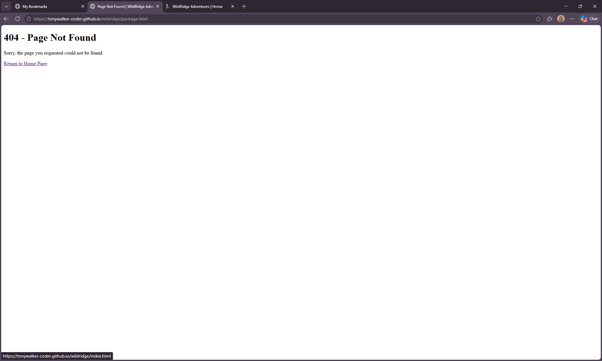

404.html page has a clear link back to the homepage.

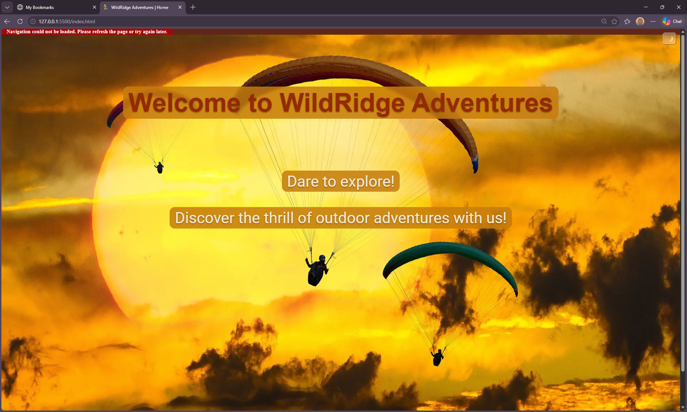

The navigation `fetch` has error handling for a failed promise and a clear user message.

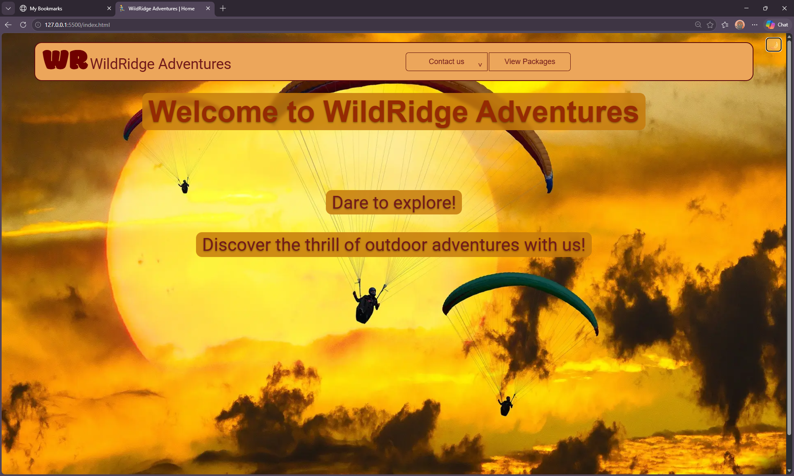

The site has a light/dark theme toggle.

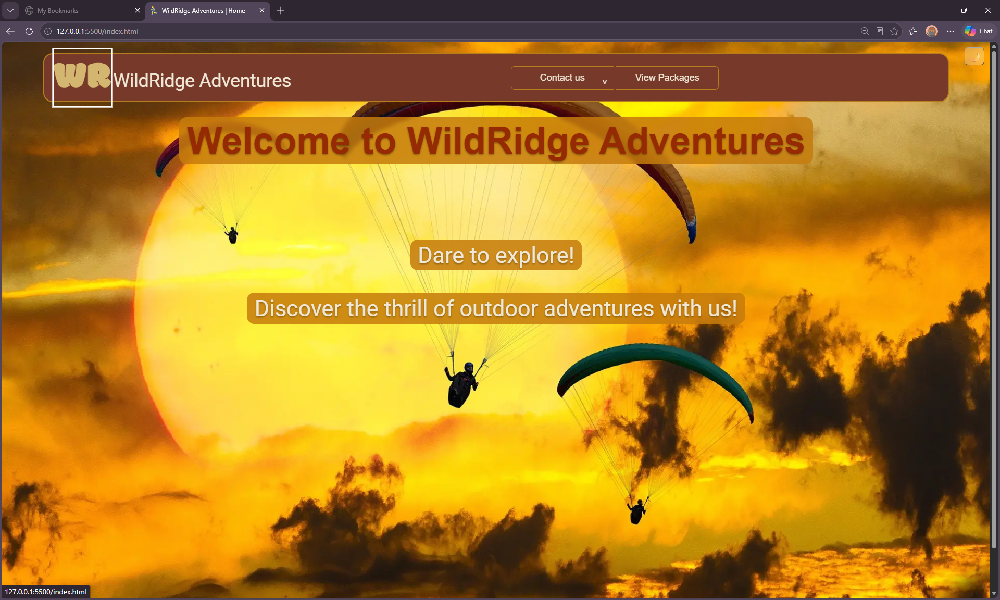

The home page is keyboard accessible.

## Accessibility

### Acceptance Criteria
* 	The site must use a consistent colour theme across all pages.
* 	The site must offer both light and dark themes.
* 	The colour palette must meet WCAG 2.1 AA contrast ratios:
* 	Minimum 4.5:1 for normal text
* 	Minimum 3:1 for large text
* 	All interactive elements (links, buttons, menus, cards) must be fully ope rable using keyboard input alone.
* 	Screen reader support must be ensured through:
* 	Semantic HTML structure
* 	Meaningful alt text for images
* 	ARIA labels where appropriate
* 	Focus states must be visible, clear, and consistent.
* 	Navigation must be predictable and consistent across the site.
* 	No content should flash more than three times per second (to avoid seizure risk)

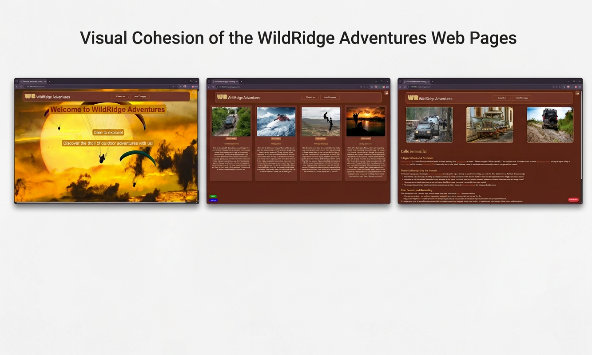

The site has a consistent colour theme throughout.

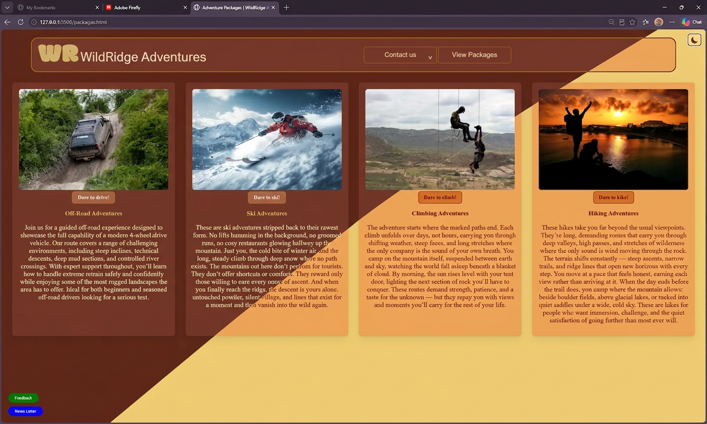

The site has a light and dark theme

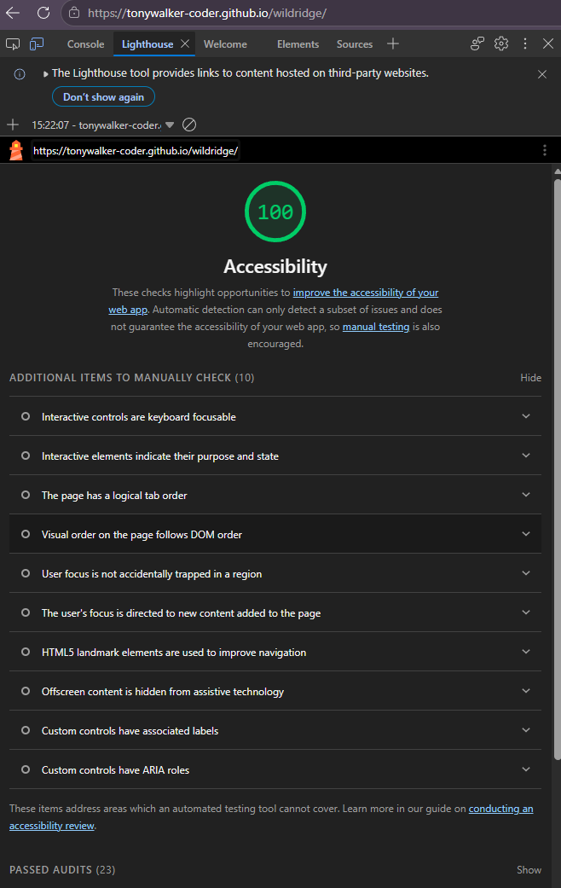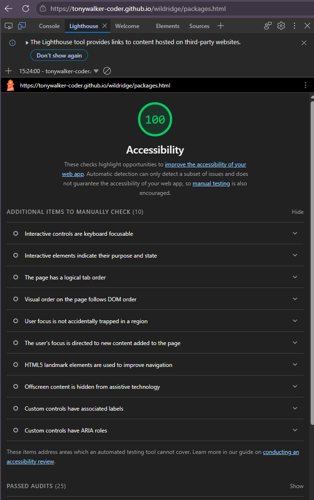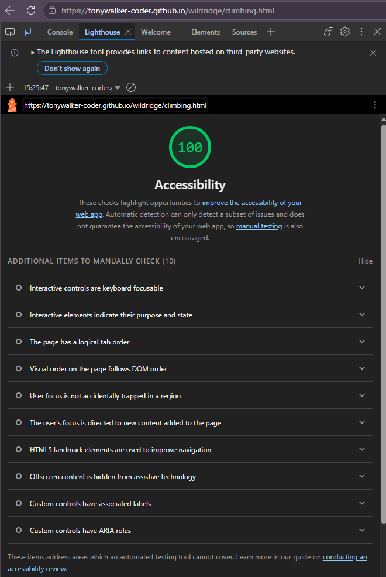

The pages pass Lighthouse accessibility testing.

*Note:* It is not possible to distinguish between the light and dark themes from Lighthouse result screenshots because the reports are identical. Therefore, only one screenshot has been included in the interest of readability.

*Note:* hiking.html, skiing.html, driving.html and climbing.html differ only in their content. As the underlying structure, accessibility implementation and Lighthouse results are effectively identical, only one representative screenshot has been included in the interest of readability.

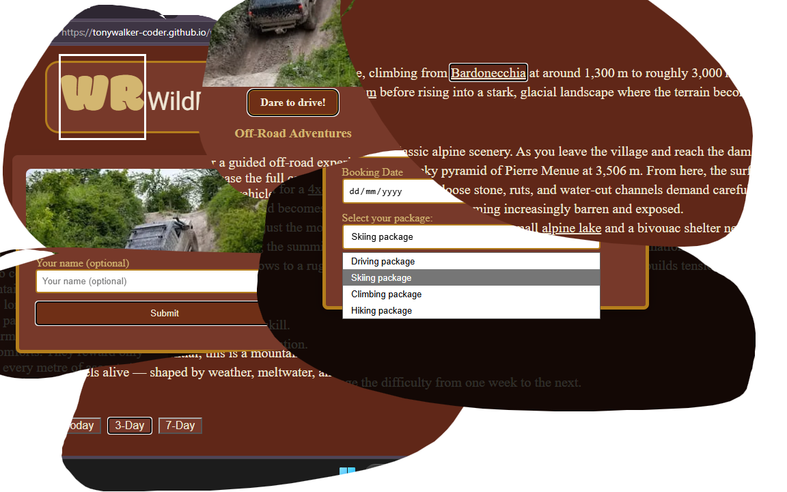

| Test                                     | Expected Result                                                    | Actual Result |
| ---------------------------------------- | ------------------------------------------------------------------ | ------------- |
| Press `Tab` repeatedly from page load    | Focus moves through links, buttons and controls in a logical order | Passed        |
| Press `Enter` on navigation links        | Selected page opens                                                | Passed        |
| Press `Enter` on weather controls        | Weather modal opens and displays requested forecast                | Passed        |
| Press `Enter` on the **Book Now** button | Booking form modal opens                                           | Passed        |
| Press `Tab` within an open modal         | User can navigate all modal controls using the keyboard            | Passed        |
| Press `Enter` on modal close button      | Modal closes successfully                                          | Passed        |
| Press `Esc` while a modal is open        | Modal closes successfully                                          | Passed        |
| Continue tabbing through page controls   | No keyboard traps encountered                                      | Passed        |

### Keyboard Access

During keyboard navigation testing, it was identified that the home-page logo link could receive keyboard focus but did not display a sufficiently visible focus indicator. A :focus-visible style was added to provide a clear visual outline for keyboard users without affecting mouse interaction.

Bug found and fixed: See [Keyboard Access](#Keyboardaccess).

## Navigation and contact

## Acceptance Criteria
* 	A consistent navbar appears on all pages.
* 	The navbar contains clear, descriptive labels for each major section.
* 	Contact details are accessible via the navigation bar.
* 	Navigation items remain visible and usable across all screen sizes.
* 	The homepage provides clear signposts to the main areas of the site.

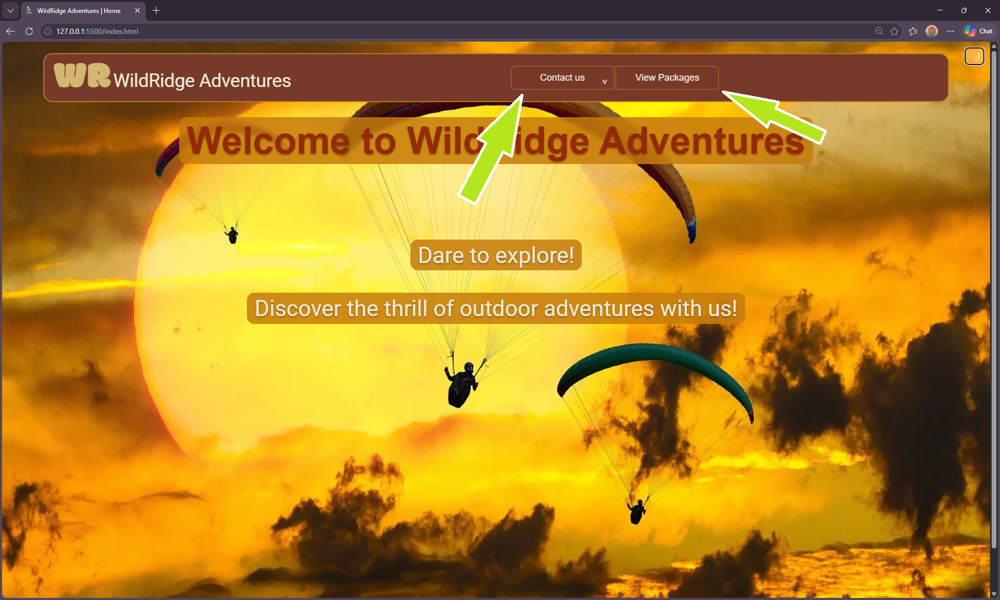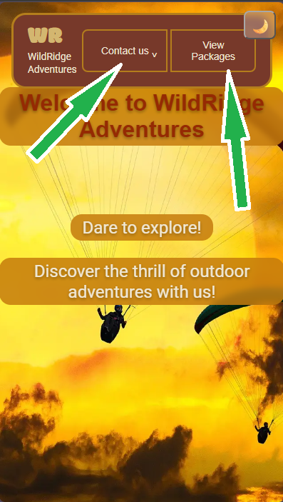

The navigation bar is available across all screen size with contacts and the link to the packages.html.

## Newsletter

### Acceptance Criteria
* 	A dedicated newsletter sign‑up feature should be available via a button and modal.
* 	The feature should includes fields for at least name and email.
* 	Submitting the data displays a clear success message.
* 	The feature uses validation to prevent incomplete or invalid submissions.

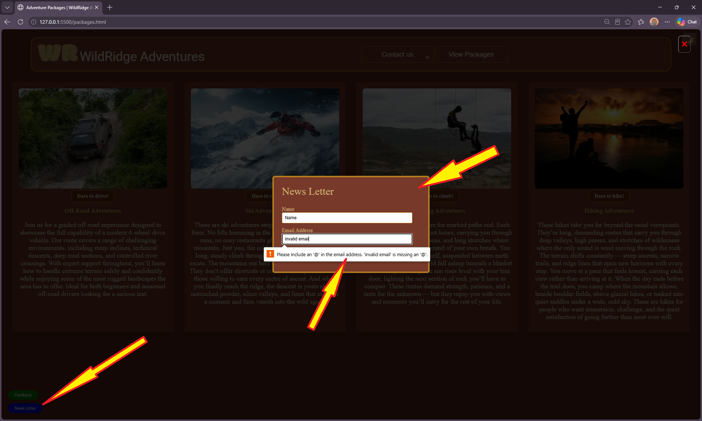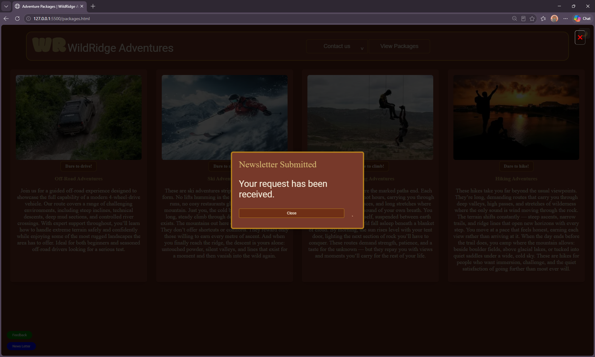

The news letter feature presents in a modal requesting the required fields with validation, on compilation a success message is generated.

*Limitation: As this project has no back-end functionality, newsletter subscriptions are not processed and the confirmation message is provided for demonstration purposes only.

## Feedback

### Acceptance Criteria
* 	A dedicated feedback function must exists.
* 	Use a dedicated button and modal for this.
* 	The feature will take the form of a modal and includes fields for name, email, and feedback message.
* 	The feature validates required fields before submission.
* 	A clear success message is shown after the data is submitted.

The news feedback feature presents in a modal allowing free text input, on compilation a success message is generated.

*Limitation: As this project has no back-end functionality, feedback submission is not processed and the confirmation message is provided for demonstration purposes only.

## Packages

### Acceptance Criteria
* Cards are created to visually represent each tour, including title, image, short description, and key details.
* Cards are responsive and display correctly on mobile, tablet, and desktop.
* Clicking a card takes the user to the full tour details page.

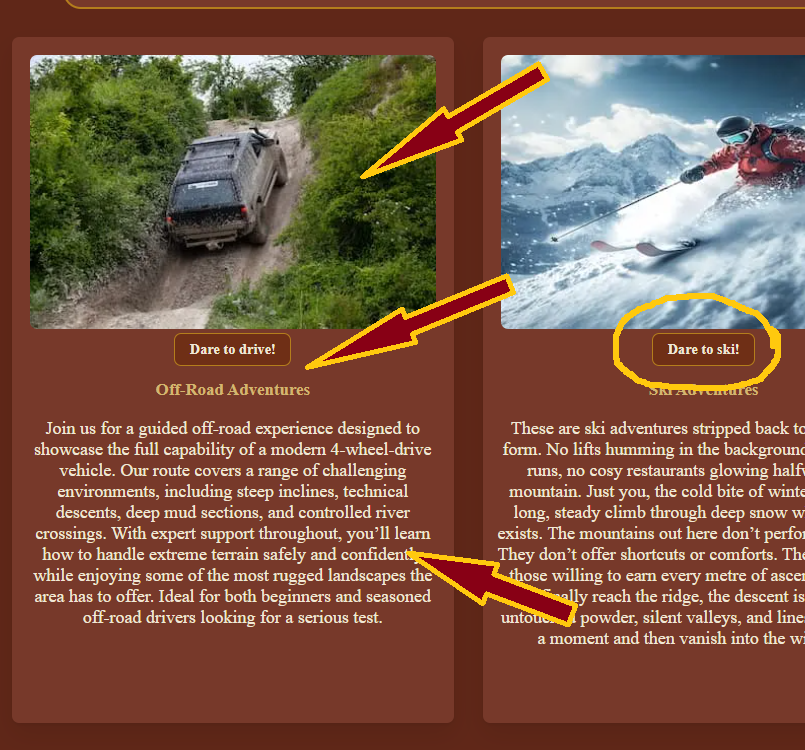

The tour cards have a descriptive image banner with a tour title and description, each card has its own navigation button to that tours page.

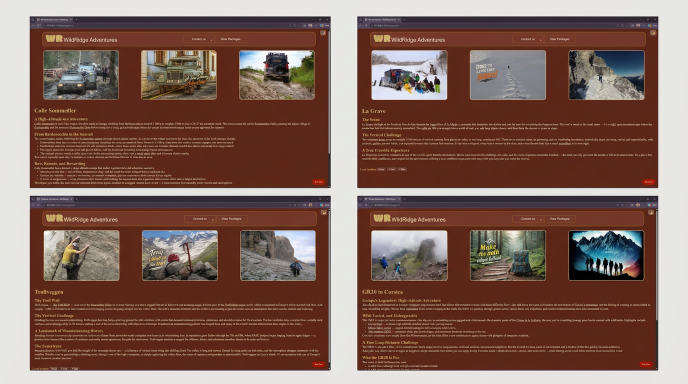

Each tour card links to its own dedicated page.

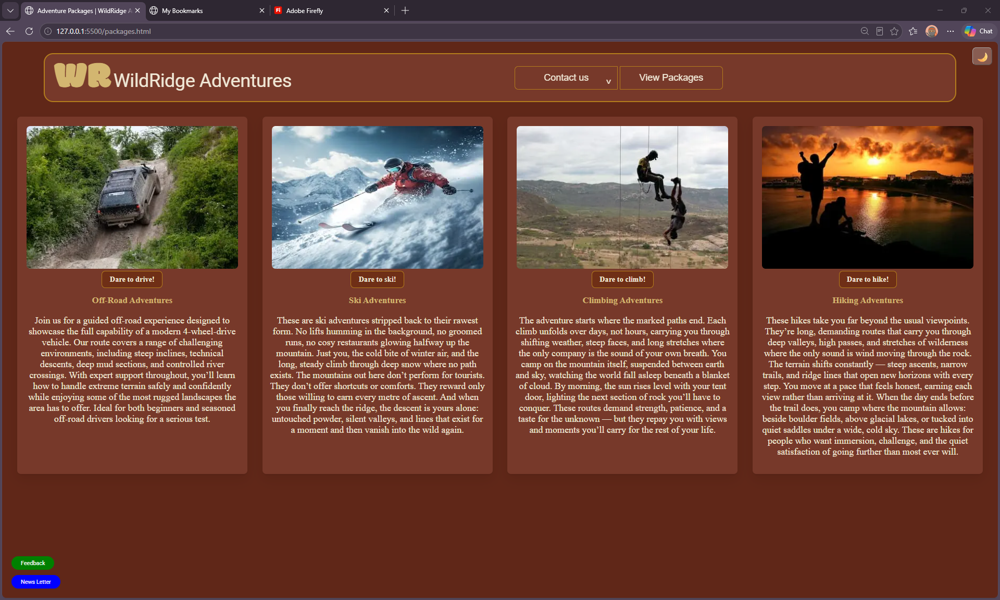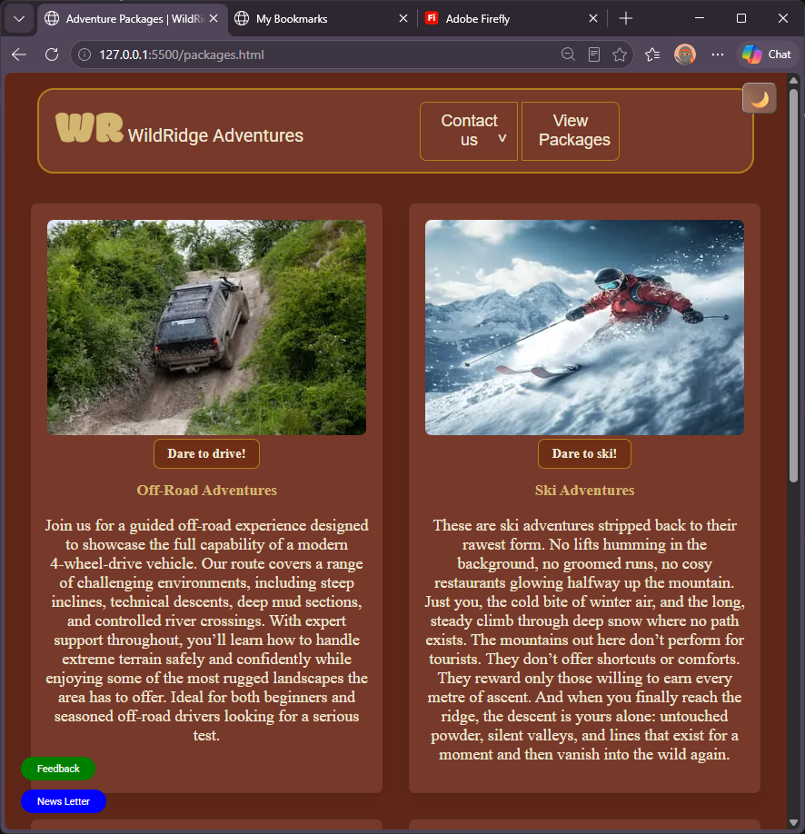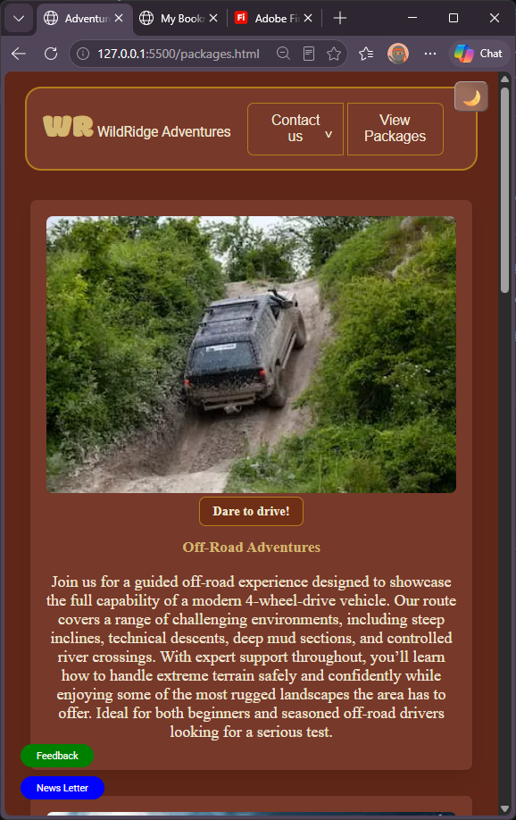

The packages.html is grid based with 3 break points to provide a responsive layout from desktop to mobile.

## API information

## Acceptance Criteria
* An API interface is implemented to fetch location‑specific weather information.
* Relevant data is displayed clearly on the tour details page by way of a modal.

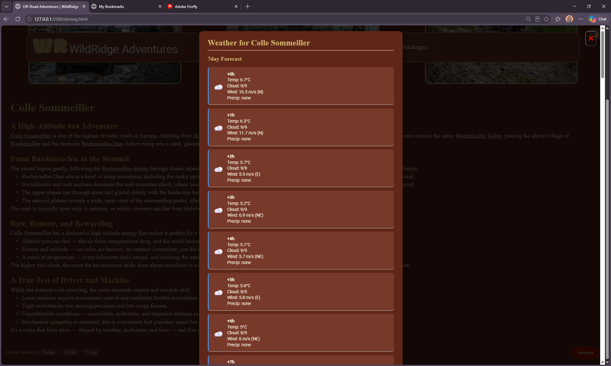

The site use a weather based API to give locla weather information relation to the specific tour location.

## Functional Testing
 
A complete walkthrough of the application was performed to verify that all interactive elements behave as expected. Each page was navigated and all user-facing controls were tested.

| Test                                                     | Expected Result                                                    | Actual Result | Screenshot |
| -------------------------------------------------------- | ------------------------------------------------------------------ | ------------- | ---------- |
| Opening the sites homepage with a corrupted or missing navigation bar| The page will display a message to the user explain the problem | Passed | [Link](#w1)|
| Press `Tab` repeatedly from page load    | Focus moves through links, buttons and controls in a logical order | Passed        |        |
| Press `Enter` on clickable elements      | The selected action is performed                                   | Passed        |        |
| Mouse hover over the site logo       | **Home Page** is displayed | Passed        |        |
| Clicking the site logo       | The user is returned to the homepage | Passed        |        |
| Clicking on `Contact us` (toggle)     | The contact panel will open close to display contact information | Passed        |        |
| Click social media links| The relevant social media homepage will open in its own tab | Passed        |        |
| Clicking on `Colour Theme Icon` 🌙 (toggle)     | The site will display either a light or dark theme | Passed        |        |
| Random clicking out side clickable elements | no effect on site | Passed        |        |
| https://tonywalker-coder.github.io/wildridge/invalidpage.html *example* | Dedicated 404.html with link will display                            | Passed        | [Link](#w2) |
| Check console| No errors                                          | Passed        |        |
| Click on packages| Packages.html will open for the user                                         | Passed        |        |
| Press `Tab` repeatedly from page load    | Focus moves through links, buttons and controls in a logical order | Passed        |        |
| Press `Enter` on clickable elements      | The selected action is performed                                   | Passed        |        |
| Click `Dare to dive!`  | The page will change to driving.html | Passed        |        |
| Click `Dare to ski!`  | The page will change to skiing.html | Passed        |        |
| Click `Dare to climb!`  | The page will change to climbing.html | Passed        |        |
| Click `Dare to hike!`  | The page will change to hiking.html | Passed        |        |
| Clicking on `Colour Theme Icon` 🌙 (toggle)     | The site will display either a light or dark theme | Passed        |        |
| Click `Feedback`  | The feedback modal will open | Passed        |        |
| Click outside the modal (at any time)  | Modal will close | Passed        |        |
| Click `X` (at any time) | Modal will close | Passed        |        |
| Press `ESC` (at any time) | Modal will close | Passed        |        |
| Click `Submit` with no data | *Please fill* error will appear| Passed        |        |
| Click `Submit` with no name | The modal will close and a success message will appear | Passed        |        |
| Click `close`, or outside the modal, or `X` or `ESC`| The modal will close the success message | Passed        |        |
| Click `News letter`  | The News Letter modal will open | Passed        |        |
| Click outside the modal, or `X` or `ESC` (at any time) | The modal will close | Passed        |        |
| Click `Submit` with no data | *Please fill* error will appear for both field| Passed        |        |
| Click `Submit` with valid data | The modal will close and a success message will appear | Passed        |        |
| Click `close`, outside the modal, `X` or `ESC`| The success message modal will close| Passed        |        |
| Random clicking out side clickable elements | no effect on site | Passed        |        |
| Check console| No errors                                          | Passed        |        |
| Clicking on `Colour Theme Icon` 🌙 (toggle) driving.html     | The site will display either a light or dark theme | Passed        |        |
| Clicking on `Colle Sommeiller` | Google maps will open in its own tab for that location | Passed        |        |
| Clicking on any of the seven links | An image modal will open for each link | Passed        |        |
| Click outside the modal, `X` or `ESC` (at any time) | The image modal will close| Passed        |        |
| Clicking on `Book Now` | The booking modal will open | Passed        |        |
| Click outside the modal, or `X` or `ESC` (at any time) | The booking modal will close| Passed        |        |
| Click `Submit` with no name, email or date | *Please fill* error will appear for each field| Passed        |        |
| Click `Submit` with valid data | The success message will be displayed| Passed        |        |
| Click `close`, outside the modal, `X` or `ESC`| The success message modal will close| Passed        |        |
| Clicking `Today`, `3-Day` or `7-Day` with no network or similar error | The *weather unavailable* message will display| Passed        |        |
| Click outside the modal, `X` or `ESC` | The message modal will close| Passed        |        |
| Clicking `Today`, `3-Day` or `7-Day` | A *please wait* message will appear before loading to prevent repeated clicking| Passed        |        |
| After Loading | The weather modal for that time period will open| Passed        |        |
| Click outside the modal, `X` or `ESC` | The weather modal will close| Passed        |        |
| Random clicking out side clickable elements | no effect on site | Passed        |        |
| Check console| No errors                                          | Passed        |        |
| Clicking on `Colour Theme Icon` 🌙 (toggle) skiing.html     | The site will display either a light or dark theme | Passed        |        |
| Clicking on `La Grave` | Google maps will open in its own tab for that location | Passed        |        |
| Clicking on any of the four links | An image modal will open for each link | Passed        |        |
| Clicking on `Book Now` | The booking modal will open | Passed        |        |
| Clicking `Today`, `3-Day` or `7-Day` | A *please wait* message will appear before loading to prevent repeated clicking| Passed        |        |
| After Loading | The weather modal for that time period will open| Passed        |        |
| Random clicking out side clickable elements | no effect on site | Passed        |        |
| Check console| No errors                                          | Passed        |        |
| Clicking on `Colour Theme Icon` 🌙 (toggle) climbing.html     | The site will display either a light or dark theme | Passed        |        |
| Clicking on `The Troll Wall ` | Google maps will open in its own tab for that location | Passed        |        |
| Clicking on any of the three links | An image modal will open for each link | Passed        |        |
| Clicking on `Book Now` | The booking modal will open | Passed        |        |
| Clicking `Today`, `3-Day` or `7-Day` | A *please wait* message will appear before loading to prevent repeated clicking| Passed        |        |
| After Loading | The weather modal for that time period will open| Passed        |        |
| Random clicking out side clickable elements | no effect on site | Passed        |        |
| Check console| No errors                                          | Passed        |        |
| Clicking on `Colour Theme Icon` 🌙 (toggle) hiking.html     | The site will display either a light or dark theme | Passed        |        |
| Clicking on `The GR20` | Google maps will open in its own tab for that location | Passed        |        |
| Clicking on any of the six links | An image modal will open for each link | Passed        |        |
| Clicking on `Book Now` | The booking modal will open | Passed        |        |
| Clicking `Today`, `3-Day` or `7-Day` | A *please wait* message will appear before loading to prevent repeated clicking| Passed        |        |
| After Loading | The weather modal for that time period will open| Passed        |        |
| Random clicking out side clickable elements | no effect on site | Passed        |        |
| Check console| No errors                                          | Passed        |        |

**Notes**

- The navbar is an injected component and was therefore fully tested on the homepage only, as its functionality remains consistent across all pages.

- The custom 404 page was tested from the homepage only, as this was sufficient to verify its functionality.

- Shared functionality was fully tested on driving.html only, as the same implementation is used on the skiing, hiking and climbing pages.
    - This included weather API timeout handling,
    - modal closing behaviour, 
    - and the booking modal.
- Links to these features were still tested on each page to confirm accessibility and correct navigation.

Screenshots for all of these test can already be found in the user stories validation section so I did not overload this test with proven screenshots.

## Testing

## Lighthouse testing

## CSS validator

<h2 style=color:red;>Errors</h1>

### use of scrollbar-gutter
Browsers with full support for *scrollbar-gutter* can allocate a persistent gutter in the scroll container’s inline direction, ensuring that layout metrics remain stable even when overflow transitions from non‑scrolling to scrolling states. Engines that lack support simply ignore the declaration, falling back to their default scrollbar behavior without affecting the computed box model. Because the property is non-destructive and gracefully degrades, it functions as a safe progressive enhancement for maintaining predictable layout geometry across heterogeneous rendering environments.
*

conclusion not an error
*

### use of layer
The validator reports *@layer* as an unrecognized at‑rule because it predates support for Cascade Layers and therefore cannot parse modern CSS constructs. Despite the warning, *@layer* is fully valid according to the current CSS specification and is implemented in all major browser engines. Since unsupported at‑rules are safely ignored by legacy parsers without affecting the cascade or computed styles, retaining *@layer* ensures proper layering semantics in compliant browsers while maintaining backward compatibility. The errors reflect validator limitations, not a defect in the stylesheet
*

conclusion not an error
*

### warnings 125

*CSS variables*
CSS custom properties resolve at runtime, not at parse time, so static validators can’t determine whether a variable exists or what value it will ultimately produce. The warnings come from that limitation, not from any issue in the code. We use CSS variables because they centralise design tokens, enable theming, reduce duplication, and keep the system scalable — all while degrading safely in browsers that don’t support them.

*webkit*
WebKit-prefixed properties exist to support browsers that still rely on legacy engine behaviour, most notably Safari on macOS and iOS. These prefixes enable features that were originally experimental or implemented before the relevant CSS specifications were finalised. Although modern browsers increasingly use the unprefixed versions, Safari continues to require certain *-webkit-* declarations for full functionality, especially for visual effects like *backdrop-filter*. The warnings simply reflect that prefixed properties fall outside the formal CSS grammar, not that they are incorrect or unsafe to use.

## Markup validator

*index.html*

*packages.html*

The validator is correct there can not be a space in a URL unless it is encoded %20

FIX renaming the file is the cleanest option

*driving.html*

*skiing.html*

*climbing.html*

*hiking.html*

### ESlint

JavaScript linting was performed using ESLint throughout development. ESLint was chosen because it supports modern JavaScript standards, including current syntax, modules. As an installed Visual Studio Code extension, ESLint provided continuous real-time feedback while coding, highlighting errors and potential issues directly within the editor.

In addition to in-editor checking, project-wide linting was performed from the command line using:

`eslint .`

This command allowed all JavaScript files within the project directory to be checked before submission, providing a final sanity check to help identify any remaining errors, warnings, or code quality issues. Using both the Visual Studio Code integration and command-line linting ensured that code quality was monitored continuously throughout development and verified prior to handover.

## Browser support

### Edge

### Chrome

### Firefox

## Mobil phone support
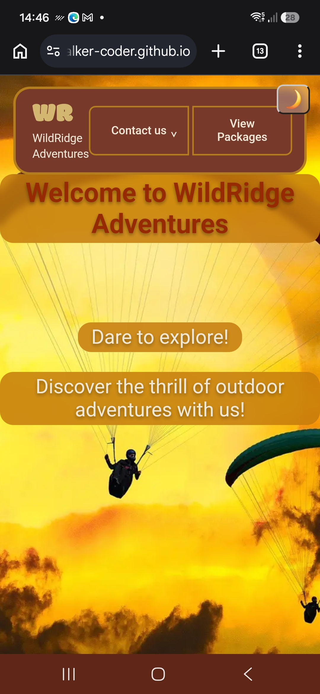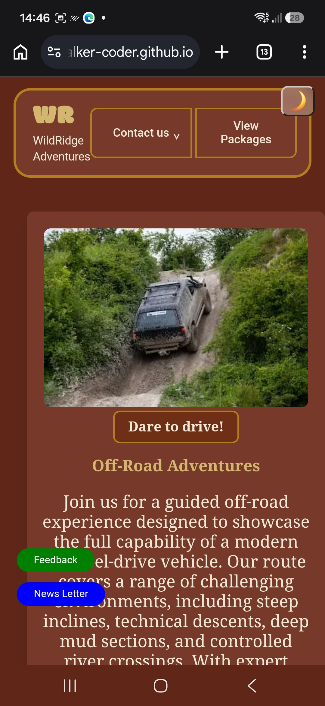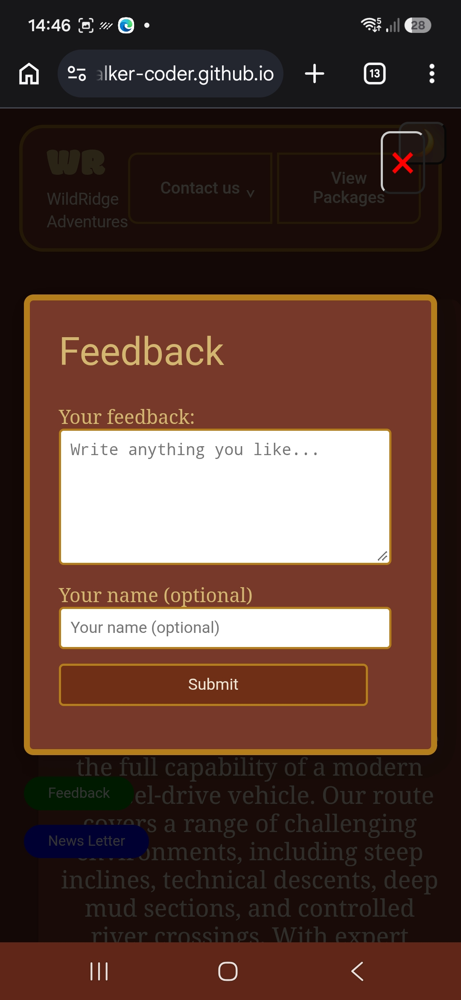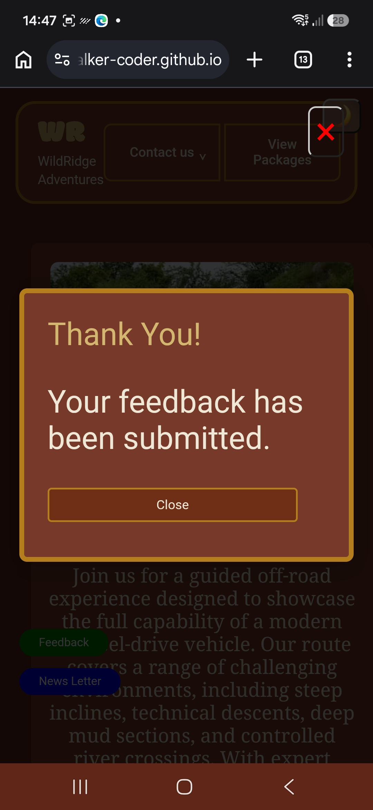

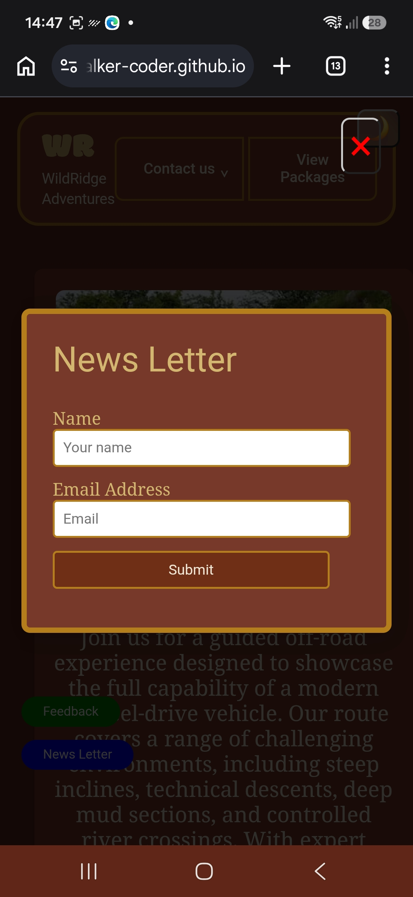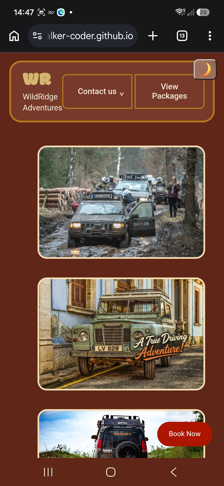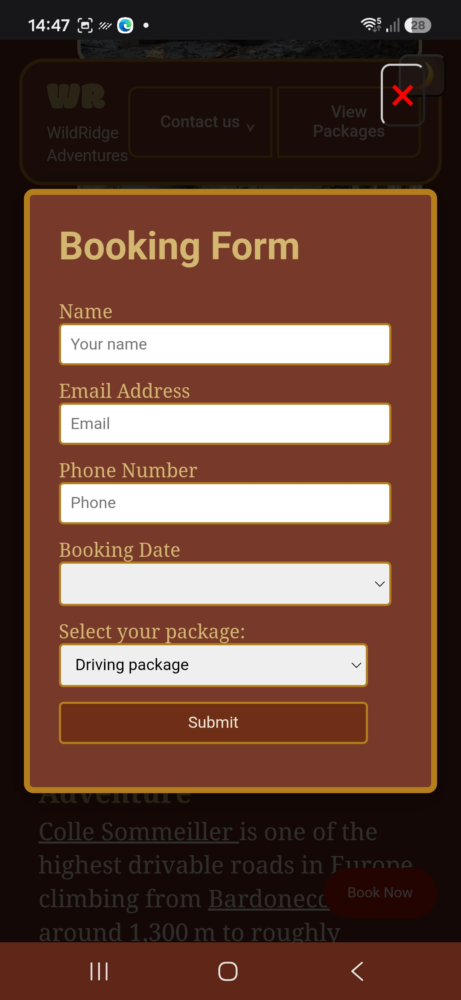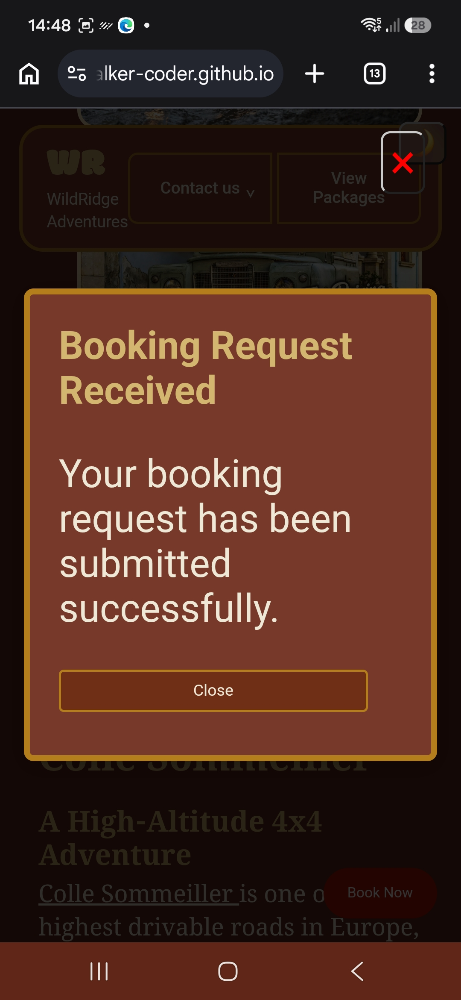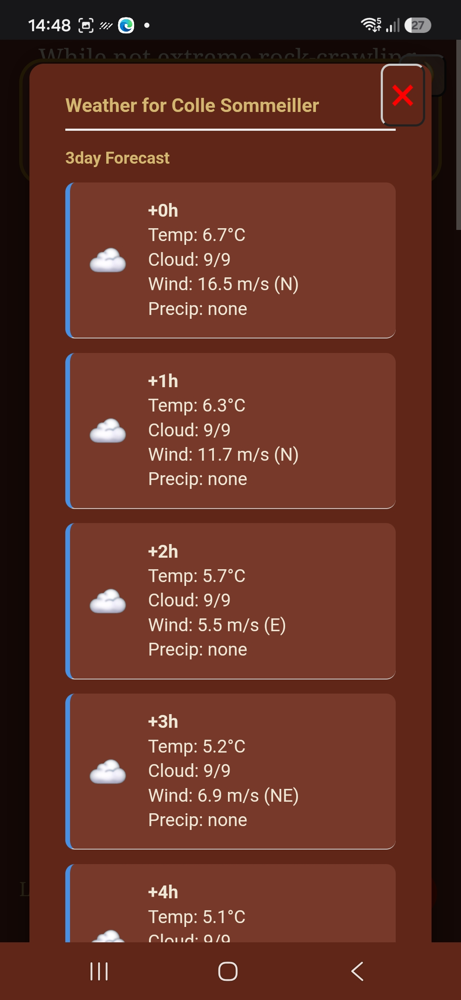

Note: This document already contains extensive evidence of desktop testing. To avoid unnecessary duplication, this section focuses solely on mobile screenshots, demonstrating the site's behaviour at the smallest supported breakpoint.

## Bugs / Design Features

### Initial load behaviour of the navigation component

The navigation bar is loaded dynamically on each page. During the first visit, the browser must fetch and parse the external component before rendering it, which introduces a brief one‑time delay. After this initial request, the component is cached by the browser, and all subsequent page loads display the navigation immediately.
This behaviour is an intentional design choice. Centralising the navigation logic ensures the codebase remains DRY, reduces duplication across pages, and simplifies long‑term maintenance. The minor first‑load delay is an expected consequence of this architecture and is not indicative of a performance issue.

### Modal Testing Note

A faint blue focus flash may still appear when clicking rapidly around the modal. This is caused by the browser briefly focusing underlying interactive elements before the modal fully intercepts the event.
I have implemented the standard mitigations (focus redirection to the modal, outline removal, and backdrop coverage), which significantly reduce the frequency of the artefact. The behaviour is cosmetic, intermittent, and does not affect functionality.
Decision: Leaving as-is. Revisit only if the modal gains additional interactive controls (zoom, navigation, captions) or if the artefact becomes more prominent after future UI changes.

### Switching between Modals

During visual testing I noted a brief transitional flash between the form modal closing and the success modal opening. The behaviour appears to be part of the standard modal transition sequence and does not indicate a functional issue.

### Delays in loading weather Modal

Because the weather modal relies on an external API, the response time can vary depending on network conditions. During slower fetches, users may click repeatedly because there’s no immediate visual feedback, which can lead to unnecessary or duplicate requests.

#### FIX

To prevent this and make the interaction feel more responsive, a “please wait” indicator was added. This provides instant confirmation that the request is in progress and helps guide the user while the data loads.

### CTA Buttons

During visual testing, I noticed that the booking, feedback, and newsletter buttons were obstructing the view on smaller screens.

#### FIX

To resolve this, I introduced a targeted media query at a 400px breakpoint, allowing the floating button to lift higher on compact displays. This ensures the UI remains clear, accessible, and visually balanced across all device sizes.

### Home Page Contrast

The original home‑page text had insufficient contrast, which reduced readability and created a weaker user experience, especially for users viewing the site on brighter screens or with accessibility needs.

### Fix

I added a darker semi‑transparent overlay behind the key text headings.
This improves the contrast significantly while still preserving the existing colour scheme and overall visual style. The result is clearer, more accessible text without altering the design identity of the page.

### Modal Image Flicker When Switching Gallery Images

Issue Description
When opening the image modal and clicking between different gallery images, the previously displayed image remained briefly visible before the new image appeared. This caused a noticeable flicker and created a poor user experience, especially when switching rapidly between images.

Cause of the Issue
The modal was already visible when the JavaScript updated the  element’s src attribute. Browsers continue to display the old bitmap until the new image has finished loading. Because the new image loads asynchronously, the old image becomes visible for a fraction of a second, resulting in the flicker.

Steps to Reproduce
Open the modal by clicking any .img-link.

Click another .img-link while the modal is still open.

Observe that the previous image flashes briefly before the new one loads.

### Fix

To prevent the flicker, the solution was to hide the current image, preload the new image, and only swap the src once the new image has fully loaded. A fade‑in transition was added to ensure a smooth visual change.

### Redundant development code

Redundant development code in packages.html & index.html has left the theme toggle inside a `
` meaning it does not comply with WCAG 2.1.

### Fix

Wrapped the function in a `<button>`like the rest of the site.

### Multiple close modals used through out script.js

Due to my inexperience when initially implementing modals, script.js accumulated multiple modal close handlers. This created the potential for several event listeners to respond to the same action, as well as situations where code could attempt to close a modal that no longer exists, potentially resulting in unhandled errors.

### Fix

All modals now use a shared action class and a single unified event handler, which calls the closeModal() function. Additional validation has been added to ensure the event originated from a valid modal element before attempting to close it, preventing null reference errors.

As part of this all redundant modal close functions and duplicate event listeners have been removed, resulting in more predictable modal behaviour.

### Multiple console errors

The original mouseover and mouseleave implementation generated numerous console errors. Events triggered by unrelated elements, such as `<a>` tags and `<button>` elements, were being processed by the handler, resulting in invalid or null event references and unnecessary error logging.

### Fix

The functionality was rewritten and moved into the navbar fetch process, allowing the event listeners to be attached directly to the intended elements once they navbar loaded. This has removed invalid event triggers being processed, eliminating the console errors.

### 7timer.info weather API free service unavailable

After submitting the project 7timer discontinued its free tier meaning the weather API failed.

### Fix

Due to the amount of time that was taken to make the original API service function correctly Microsoft Copilot was used to source and implement a new weather API and rewrite the original function.

### Weather API unavailable service hang

When the Weather API service is unavailable, the application remained stuck on the "Please Wait" prompt. This left the user without any indication that the request had failed or that the service was unreachable.

### Fix

The application now uses the previously unused status response to detect when a connection to the Weather API cannot be established. When this condition is encountered, the "Please Wait" prompt is automatically removed and an informational modal is displayed to notify the user that the service is unavailable.

The fix was tested by disconnecting the network before initiating the weather request, confirming that the application now handles the failure with user feedback.

### Navigation Resource Fallback

A fallback was added to the navigation loader to handle situations where the shared navbar.html cannot be retrieved. The application now checks the HTTP response before rendering the navigation and displays a user-friendly message if it is unavailable, preventing a server 404 error on the page.

*note this is only available via the homepage as the site would not function without the navigation

### 404.html

Added a 404.html with link back to homepage.

### Keyboard access

During keyboard navigation testing, it was identified that the home-page logo link could receive keyboard focus but did not display a sufficiently visible focus indicator. A :focus-visible style was added to provide a clear visual outline for keyboard users without affecting mouse interaction.

## Post-testing

Post-testing note: As some testing activities resulted in minor code changes and bug fixes, all validators, including HTML validation, CSS validation and ESLint, were run again across the project to verify that no new issues or code violations were introduced.