## Table of Contents

- [User Story Validation](#userstoryvalidation)
- [Lighthouse](#lighthouse)
- [Validators](#css)
- [ESlint](#lint)
- [Colour palette](#colours)
- [Visual check](#visual-check)
- [Link Check](#link-check)
- [Browser support](#browser-support)
- [Bugs / Design Features](#bugs)

## User Story Validation

## Homepage

### Acceptance Criteria
* 	The homepage establishes the overall theme and visual identity of the site.
* 	A fixed navbar provides consistent navigation across all pages.
* 	The layout is fully responsive across a range of breakpoints (mobile, tablet, desktop, large desktop).
* 	The homepage links to the packages page.
* 	A hero image or gallery
* 	A short, engaging description
* 	Clear calls to action
* 	Contact details are visible or easily accessible from the navbar/footer

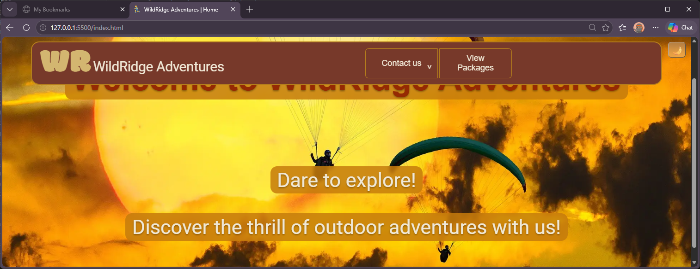

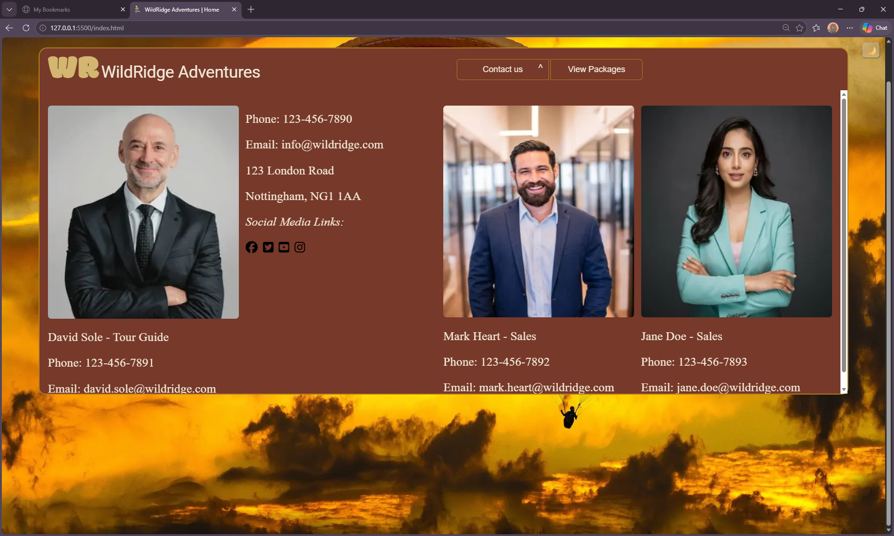

The homepage has a fixed navigation bar and contact details can be accessed via the navigation bar, the navigation bar has a link to the packages.html

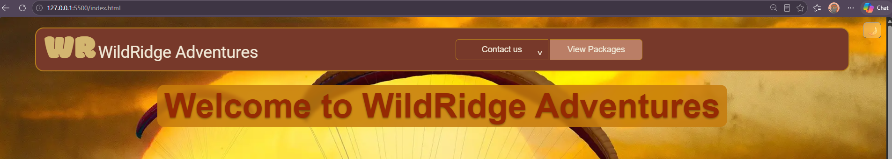

the homepage remains responsive with the use of clamp

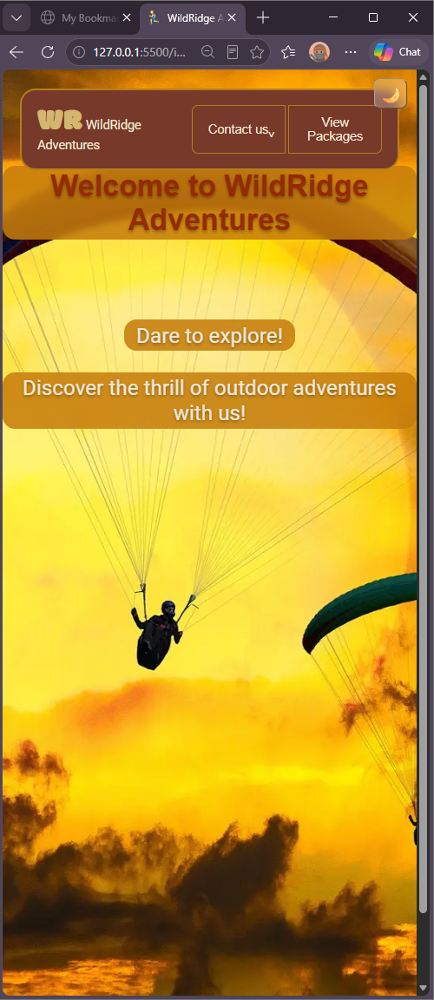

## Testing

## Lighthouse testing

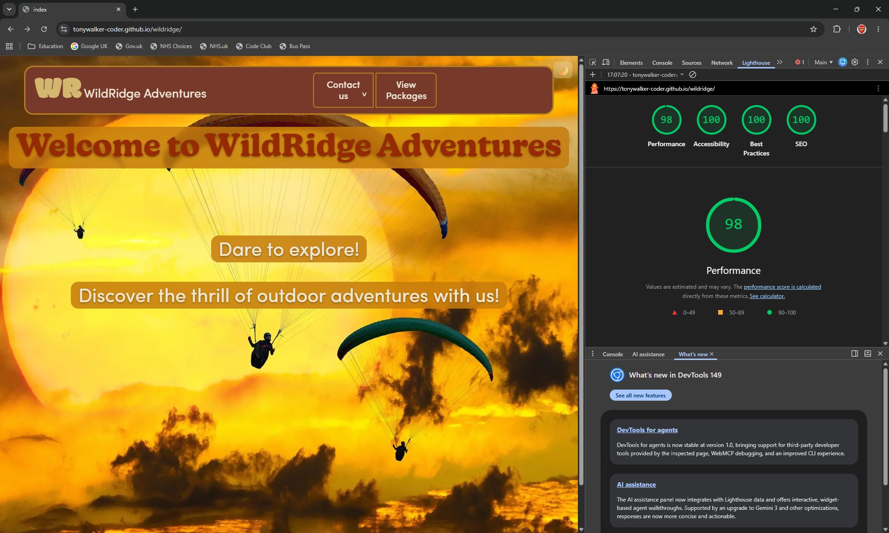

## CSS validator

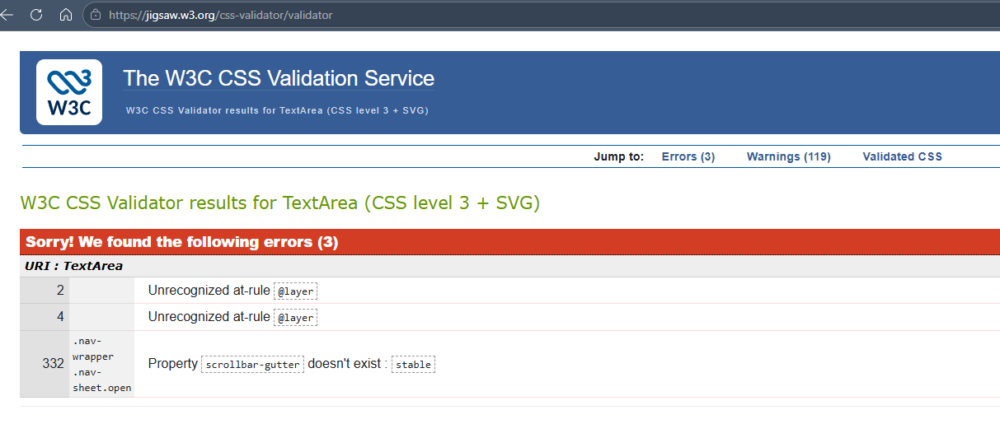

<h2 style=color:red;>Errors</h1>

### use of scrollbar-gutter
Browsers with full support for *scrollbar-gutter* can allocate a persistent gutter in the scroll container’s inline direction, ensuring that layout metrics remain stable even when overflow transitions from non‑scrolling to scrolling states. Engines that lack support simply ignore the declaration, falling back to their default scrollbar behavior without affecting the computed box model. Because the property is non-destructive and gracefully degrades, it functions as a safe progressive enhancement for maintaining predictable layout geometry across heterogeneous rendering environments.
*

conclusion not an error
*

### use of layer
The validator reports *@layer* as an unrecognized at‑rule because it predates support for Cascade Layers and therefore cannot parse modern CSS constructs. Despite the warning, *@layer* is fully valid according to the current CSS specification and is implemented in all major browser engines. Since unsupported at‑rules are safely ignored by legacy parsers without affecting the cascade or computed styles, retaining *@layer* ensures proper layering semantics in compliant browsers while maintaining backward compatibility. The errors reflect validator limitations, not a defect in the stylesheet
*

conclusion not an error
*

### warnings 125

*CSS variables*
CSS custom properties resolve at runtime, not at parse time, so static validators can’t determine whether a variable exists or what value it will ultimately produce. The warnings come from that limitation, not from any issue in the code. We use CSS variables because they centralise design tokens, enable theming, reduce duplication, and keep the system scalable — all while degrading safely in browsers that don’t support them.

*webkit*
WebKit-prefixed properties exist to support browsers that still rely on legacy engine behaviour, most notably Safari on macOS and iOS. These prefixes enable features that were originally experimental or implemented before the relevant CSS specifications were finalised. Although modern browsers increasingly use the unprefixed versions, Safari continues to require certain *-webkit-* declarations for full functionality, especially for visual effects like *backdrop-filter*. The warnings simply reflect that prefixed properties fall outside the formal CSS grammar, not that they are incorrect or unsafe to use.

## Markup validator

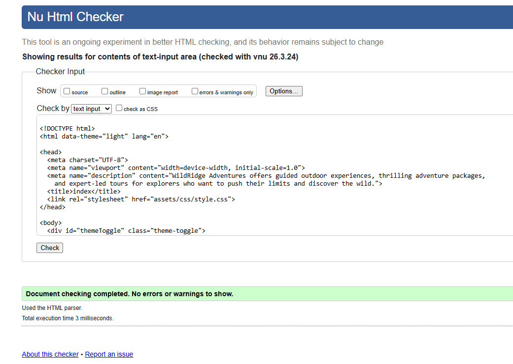
*index.html*

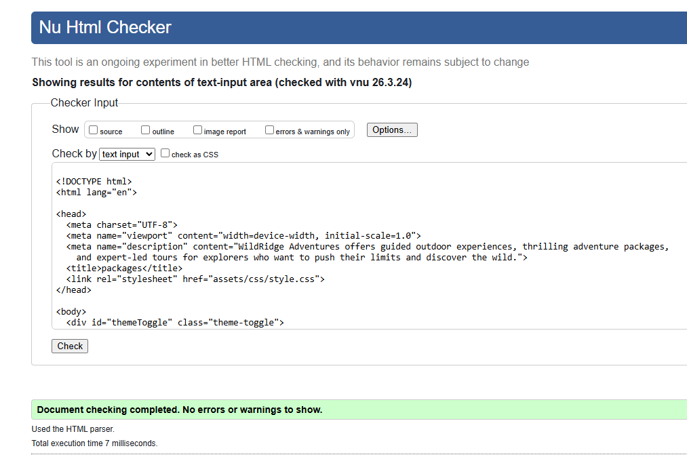
*packages.html*

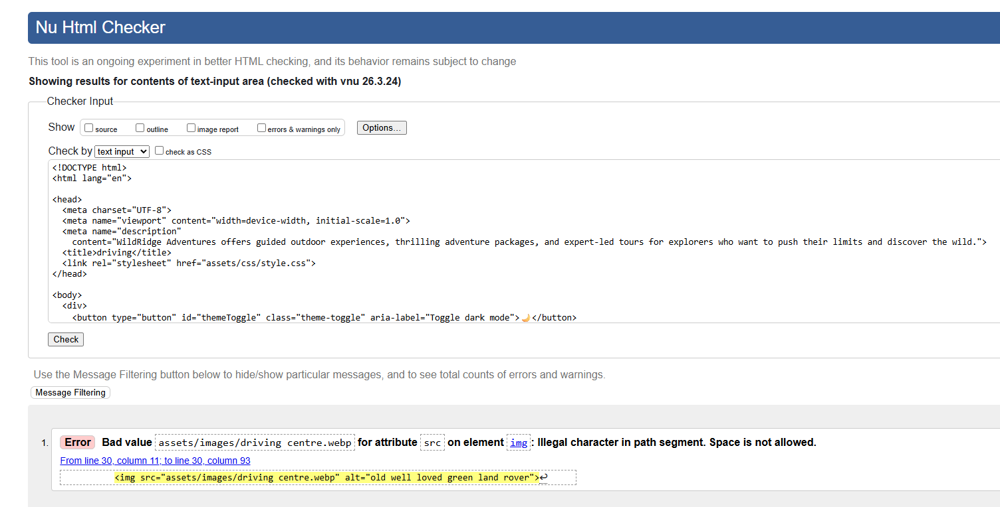

The validator is correct there can not be a space in a URL unless it is encoded %20

FIX renaming the file is the cleanest option

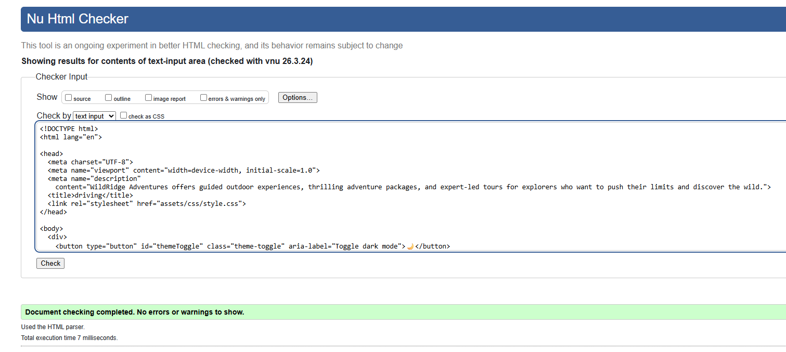
*driving.html*

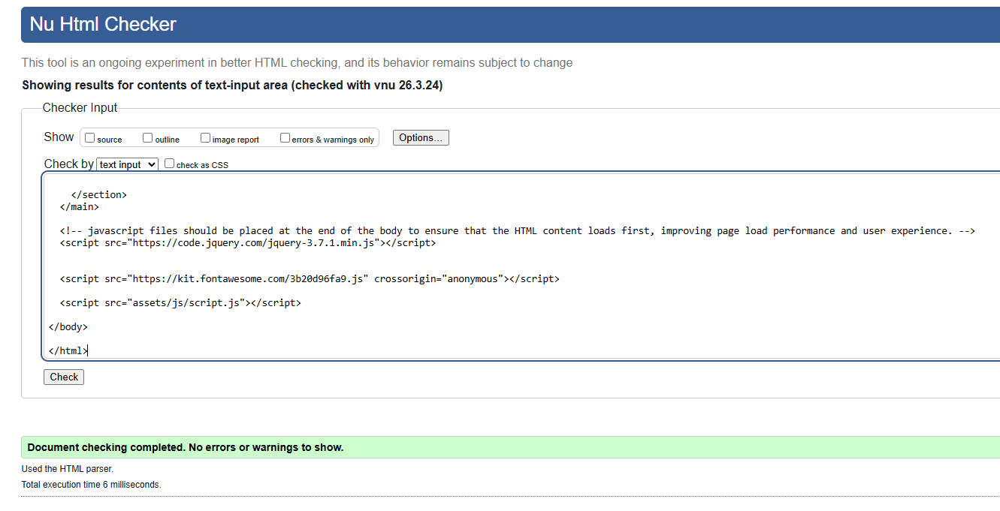
*skiing.html*

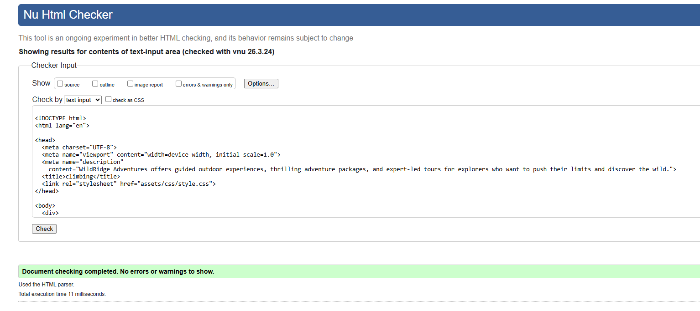
*climbing.html*

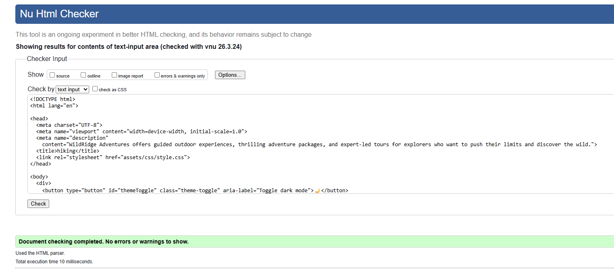
*hiking.html*

### ESlint

JavaScript linting was performed using ESLint throughout development. ESLint was chosen because it supports modern JavaScript standards, including current syntax, modules. As an installed Visual Studio Code extension, ESLint provided continuous real-time feedback while coding, highlighting errors and potential issues directly within the editor.

In addition to in-editor checking, project-wide linting was performed from the command line using:

`eslint .`

This command allowed all JavaScript files within the project directory to be checked before submission, providing a final sanity check to help identify any remaining errors, warnings, or code quality issues. Using both the Visual Studio Code integration and command-line linting ensured that code quality was monitored continuously throughout development and verified prior to handover.

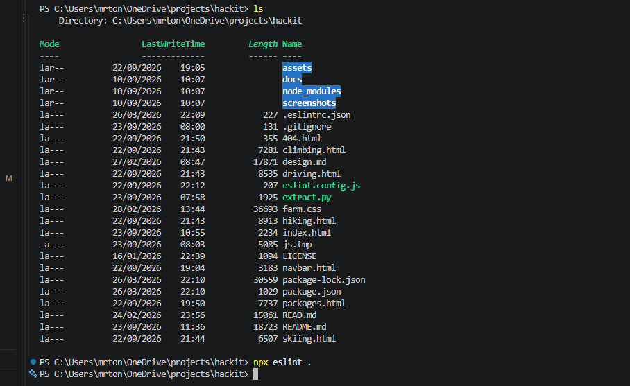

## Colour palette

### Dark theme

- text / background : 9.23:1
- text / surface : 7.16:1
- heading / background : 5.73:1 * suitable for headings
- heading / surface : 4.45:1 * poor but not likely to be used 

### Light theme

- text / background : 7.4 : 1
- text / surface : 5.48 : 1
- heading / background : 8.13:1
- heading / surface : 6.02:1

### Alert colours

- success : 6.91 : 1
- warning : 5.81 : 1
- error : 7.52 : 1

## Visual Check

| page| dark theme | light theme
|------|---|---|
| index | ✓ | ✓ |
| contact | ✓ | ✓ |
| product | ✓ | ✓ |
| feedback modal | ✓ | ✓ |
| newsletter modal | ✓ | ✓ |
| driving | ✓ | ✓ |
| skiing | ✓ | ✓ |
| climbing | ✓ | ✓ |
| hiking | ✓ | ✓ |
| image modal | ✓ | ✓ |
| booking modal | ✓ | ✓ |
| weather modal | ✓ | ✓ |
| success modal | ✓ | ✓ |

## Link Check

| page| links & buttons 
|------|---|
| logo| ✓ |
| contact | ✓ |
| social media| ✓ |
| theme | ✓ |
| product | ✓ |
| feedback modal | ✓ |
| newsletter modal | ✓ |
| driving | ✓ |
| skiing | ✓ |
| climbing | ✓ |
| hiking | ✓ |
| image modal | ✓ |
| booking modal | ✓ |
| weather modal | ✓ |
| success modal | ✓ |

## Browser support

### Edge

### Chrome
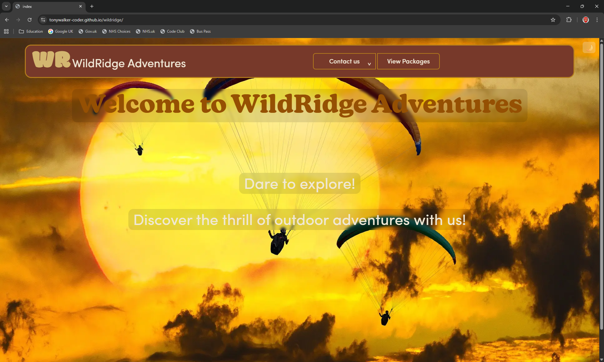

### Firefox

## Bugs / Design Features

### Initial load behaviour of the navigation component

The navigation bar is loaded dynamically on each page. During the first visit, the browser must fetch and parse the external component before rendering it, which introduces a brief one‑time delay. After this initial request, the component is cached by the browser, and all subsequent page loads display the navigation immediately.
This behaviour is an intentional design choice. Centralising the navigation logic ensures the codebase remains DRY, reduces duplication across pages, and simplifies long‑term maintenance. The minor first‑load delay is an expected consequence of this architecture and is not indicative of a performance issue.

### Modal Testing Note

A faint blue focus flash may still appear when clicking rapidly around the modal. This is caused by the browser briefly focusing underlying interactive elements before the modal fully intercepts the event.
I have implemented the standard mitigations (focus redirection to the modal, outline removal, and backdrop coverage), which significantly reduce the frequency of the artefact. The behaviour is cosmetic, intermittent, and does not affect functionality.
Decision: Leaving as-is. Revisit only if the modal gains additional interactive controls (zoom, navigation, captions) or if the artefact becomes more prominent after future UI changes.

### Switching between Modals

During visual testing I noted a brief transitional flash between the form modal closing and the success modal opening. The behaviour appears to be part of the standard modal transition sequence and does not indicate a functional issue.

### Delays in loading weather Modal

Because the weather modal relies on an external API, the response time can vary depending on network conditions. During slower fetches, users may click repeatedly because there’s no immediate visual feedback, which can lead to unnecessary or duplicate requests.

#### FIX

To prevent this and make the interaction feel more responsive, a “please wait” indicator was added. This provides instant confirmation that the request is in progress and helps guide the user while the data loads.

### CTA Buttons

During visual testing, I noticed that the booking, feedback, and newsletter buttons were obstructing the view on smaller screens.

#### FIX

To resolve this, I introduced a targeted media query at a 400px breakpoint, allowing the floating button to lift higher on compact displays. This ensures the UI remains clear, accessible, and visually balanced across all device sizes.

### Home Page Contrast

The original home‑page text had insufficient contrast, which reduced readability and created a weaker user experience, especially for users viewing the site on brighter screens or with accessibility needs.

### Fix

I added a darker semi‑transparent overlay behind the key text headings.
This improves the contrast significantly while still preserving the existing colour scheme and overall visual style. The result is clearer, more accessible text without altering the design identity of the page.

### Modal Image Flicker When Switching Gallery Images

Issue Description
When opening the image modal and clicking between different gallery images, the previously displayed image remained briefly visible before the new image appeared. This caused a noticeable flicker and created a poor user experience, especially when switching rapidly between images.

Cause of the Issue
The modal was already visible when the JavaScript updated the  element’s src attribute. Browsers continue to display the old bitmap until the new image has finished loading. Because the new image loads asynchronously, the old image becomes visible for a fraction of a second, resulting in the flicker.

Steps to Reproduce
Open the modal by clicking any .img-link.

Click another .img-link while the modal is still open.

Observe that the previous image flashes briefly before the new one loads.

### Fix

To prevent the flicker, the solution was to hide the current image, preload the new image, and only swap the src once the new image has fully loaded. A fade‑in transition was added to ensure a smooth visual change.

### Redundant development code

Redundant development code in packages.html & index.html has left the theme toggle inside a '
' meaning it does not comply with WCAG 2.1.

### Fix

Wrapped the function in a '<button>' like the rest of the site.

### Multiple close modals used through out script.js

Due to my inexperience when initially implementing modals, script.js accumulated multiple modal close handlers. This created the potential for several event listeners to respond to the same action, as well as situations where code could attempt to close a modal that no longer exists, potentially resulting in unhandled errors.

### Fix

All modals now use a shared action class and a single unified event handler, which calls the closeModal() function. Additional validation has been added to ensure the event originated from a valid modal element before attempting to close it, preventing null reference errors.

As part of this all redundant modal close functions and duplicate event listeners have been removed, resulting in more predictable modal behaviour.

### Multiple console errors

The original mouseover and mouseleave implementation generated numerous console errors. Events triggered by unrelated elements, such as <a> tags and <button> elements, were being processed by the handler, resulting in invalid or null event references and unnecessary error logging.

### Fix

The functionality was rewritten and moved into the navbar fetch process, allowing the event listeners to be attached directly to the intended elements once they navbar loaded. This has removed invalid event triggers being processed, eliminating the console errors.

### 7timer.info weather API free service unavailable

After submitting the project 7timer discontinued its free tier meaning the weather API failed.

### Fix

Due to the amount of time that was taken to make the original API service function correctly Microsoft Copilot was used to source and implement a new weather API and rewrite the original function.

### Weather API unavailable service hang

When the Weather API service is unavailable, the application remained stuck on the "Please Wait" prompt. This left the user without any indication that the request had failed or that the service was unreachable.

### Fix

The application now uses the previously unused status response to detect when a connection to the Weather API cannot be established. When this condition is encountered, the "Please Wait" prompt is automatically removed and an informational modal is displayed to notify the user that the service is unavailable.

The fix was tested by disconnecting the network before initiating the weather request, confirming that the application now handles the failure with user feedback.

### Navigation Resource Fallback

A fallback was added to the navigation loader to handle situations where the shared navbar.html cannot be retrieved. The application now checks the HTTP response before rendering the navigation and displays a user-friendly message if it is unavailable, preventing a server 404 error on the page.

*note this is only available via the homepage as the site would not function without the navigation

### 404.html

Added a 404.html with link back to homepage.

